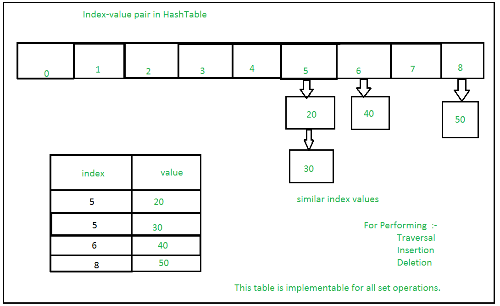
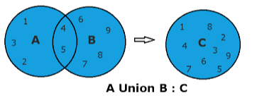
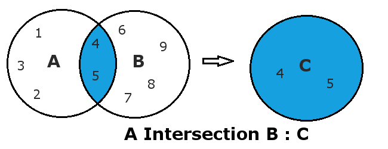

# Sets

In Python, a set is a collection of unique elements that are unordered and mutable. 
Sets are represented by curly braces {}, with the values enclosed within the braces.     
Developers often choose sets over a list because it is optimal for checking whether a specific element is contained in the set.      

```python
my_set = {1, 2, 3, 4, 5} 
my_set.add(6)
print(my_set) #Output: {1, 2, 3, 4, 5, 6}

my_set.remove(2)
print(my_set) #Output: {1, 3, 4, 5}
```

## Hashing



Since sets are unordered, you cannot access items using indexes the way you would in lists. In order to check if an element is contained in the set, you need to use a hash table.  

Hashing is a popular technique for storing and retrieving data as quickly as possible, typically in O(1) time. 
Hashing is a solution that can be used in almost all situations and performs extremely well. 

Some common hashing components are the hash table, which gives the functionality in which a collection of data is stored
so it is easier to search and find elements later; the hash function, which maps each key into a unique slot index; and chaining, which 
makes each cell of a hash table point to a linked list of records that have the same hash function value. 

Here's an examples of Hashing:

```python
my_set = {10, 20, 30, 40, 50}
print(hash(my_set))
```

## Union



In Python, the union method returns a new set that contains all the items from the original set. 
The union of two given sets is the set that contains all the elements of both. 

Union does not include duplicate values in the resulting set. 
The union is denoted by the "|" operator. 

Here's an example of Union: 

```python
set1 = {1, 2, 3}
set2 = {3, 4, 5}
set3 = set1 | set2
print(set3) #Output: {1, 2, 3, 4, 5}
```


## Intersection



In Python, the intersection method returns a new set with an element that is common to all sets. 

The intersection of two given sets is the largest set, which contains all the elements that are common to both. 
The intersection is denoted by .intersection(). 

Here's an example of Intersection: 

```Python
set1 = {1, 3, 4}
set2 = {3, 4, 5}
set3 = set1.intersection(set2)
print(set3) #Output: {3, 4}
```

## Problem 1 : Hashing 

Complete this function to take a list of strings as input and return a dictionary where the keys are the strings and the values are the number of times each string appears in the list. 

```python
def hash_strings(strings):
    count_strings = {}
    for s in strings:
        if #Add code here
        else: 
            count_strings[s] = 1 
    return count_strings
```

## Test Problem 1 : 

```python
strings = ['Hyacinth', 'Tulip', 'Iris', 'Daffodil', 'Peony']
result = hash_strings(strings)
assert result == {'Hyacinth': 1, 'Tulip': 1, 'Iris': 1, 'Daffodil': 1, 'Peony': 1}
```

## Problem 2 : Union

Complete this function to take two lists of integers as input and return a set containing the union of the two input lists.

```python
def union(list1, list2):
    set1 = set(list1)
    #Add code here
    return set1.union(set2)
```

## Test Problem 2 : 

```python
list1 = [1, 2, 3, 4, 5]
list2 = [4, 5, 6, 7, 8, 9, 10]
result = union(list1, list2) #(1, 2, 3, 4, 5, 6, 7, 8, 9, 10)
assert result == {1, 2, 3, 4, 5, 6, 7, 8, 9, 10}
```


## Problem 3 : Intersection

Complete this function to take two lists of integers as input and return a set containing the intersection of the two input lists. 

```python
def intersection(list1, list2):
    set1 = set(list1)
    #Add code here
    return set1.intersection(set2)
```


## Test Problem 3 : 

```python
list1 = [1, 2, 3, 4, 5]
list2 = [4, 5, 6, 7, 8, 9, 10]
result = intersection(list1, list2) #(4, 5)
assert result == {4, 5}
```

You can check your code with the solution here: [Solution](Sets_Solution.py)


[Back to Welcome Page](README.md)