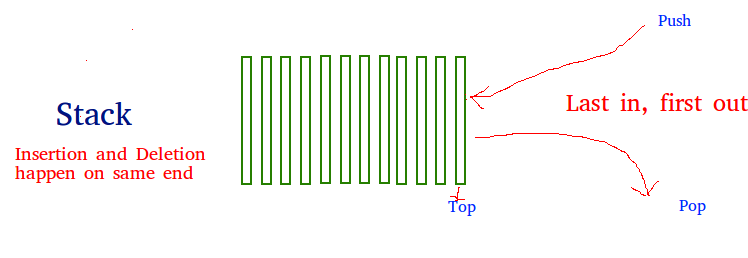
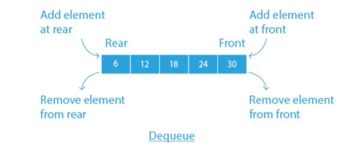
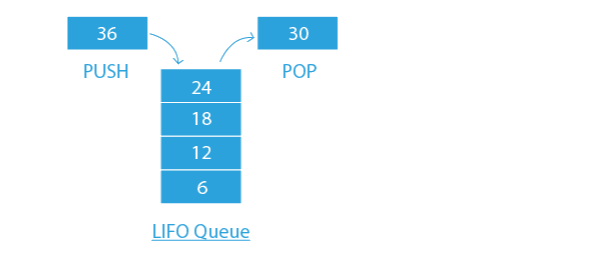

# Stacks

 In Python, a stack is a linear data structure that stores items in a last-in, first-out manner. 
In a stack, a new element is added at one end, and an element is removed from that end only. 

You can implement a stack in Python using a list data structure, append() to push elements onto the stack, and the pop() method.

Functions associated with a stack are empty(), size(), push(), and pop(). 
Insert and delete are the most commonly used functions associated with a stack, they are often called push and pop. 

There are various ways to implement a stack in Python. You can use data structures and modules from the Python library like list, Collections.deque, or queue.LifoQueue.



```python
stack = [1, 2, 3]
print(stack) #Output: 1, 2, 3
```

## List

In Python, you can use the built-in data structure list as a stack. Instead of push(), append() is used to add elements to the top of the stack, while pop() removes the element in last-in, first-out order. 

In Python, you can use the built-in data structure list as a stack. Instead of push(), append() is used to add elements to the top of the stack, while pop() removes the element in last-in, first-out order. 

Here's an examples of List:

```python
stack = []
stack.append('a')
stack.append('z')
print(stack) #Output: ['a', 'z']

print(stack.pop())
print(stack) #Output: ['a']
```

## Collections.deque



In Python, stacks can be implemented using the deque class from the collections module. Deque is preferred over list in cases where we need quicker append and pop operations from both ends of the container.  

While Deque provides an O(1) time complexity for append and pop operations, List only provides an O(n) time complexity.

Here's an example of Collections.deque: 

```python
from collections import deque

stack = deque()

stack.append('a')
stack.append('z')

print(stack) #Output: deque(['a', 'z'])

print(stack.pop())

print(stack) #Output: deque(['a'])
```


## Queue Module



In Python, queue operates much like the Collections.deque module. 
Data is inserted into the queue using the put() function, and get() takes data out of the queue.
Queue has many built-in functions in its module to insert and remove data. 

Some functions include maxsize to show the number of items allowed in the queue; empty() will return true when the queue is empty; full() returns true if there are
maxsize items in the queue; get() removes and returns items from the queue; and qsize(), which returns the number of items in the queue. 

Here's an example of Queue: 

```Python
from queue import LifoQueue

stack = LifoQueue(maxsize=2)

stack.put('a')
stack.put('z')

print(stack.full()) #Output: False
print(stack.qsize) #Output: 2

print(stack.get())
print(stack.get())

print(stack.empty()) #Output: True
```

## Problem 1 : List 

Complete this function to take a list as an input and return a new list with the elements in reverse order.

```python
def reverse_order(lst):
    return lst[] #Add code here
```

## Test Problem 1 : 

```python
lst = [1, 2, 3, 4, 5]
result = reverse_order(lst)
assert result == [5, 4, 3, 2, 1]
```

## Problem 2 : Collections.dequeue

Complete this function to take a string as input and return True if the string is a palindrome, and False otherwise. 

```python
from  collections import deque

def check_if_palindrome(s):
    words = deque(s)
    while len(words) > 1:
        #Add code here
    return True
```

## Test Problem 2 : 

```python
word1 = 'kayak'
word2 = 'airplane'
assert check_if_palindrome(word1) == True
assert check_if_palindrome(word2) == False 
```


## Problem 3 : Queue Module

Complete this function to implement a Queue data structure using the queue module in Python.  

```python
from queue import Queue

class PracticeQueue:
    def __init__(self):
        #Add code here

    def enqueue(self, element):
        #Add code here

    def dequeue(self):
        #Add code here
    
    def search_empty(self):
        #Add code here
    
    def size(self):
        #Add code here
```


## Test Problem 3 : 

```python
p = PracticeQueue()
assert p.search_empty() == True
assert p.size() == 0
p.enqueue(1)
p.enqueue(2)
assert p.search_empty() == False 
assert p.size() == 2
assert p.dequeue() == 1
assert p.dequeue() == 2
assert p.search_empty() == True 
assert p.size() == 0
```

You can check your code with the solution here: [Solution](Stacks_Solution.py)


[Back to Welcome Page](README.md)