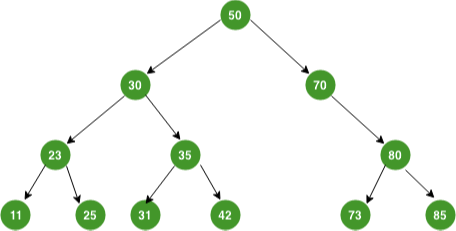
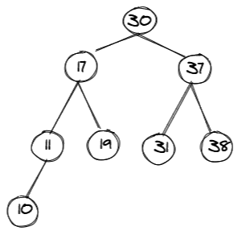

# Trees

 In Python, trees are like linked lists where the nodes are connected together by pointers. However, where linked lists can only connect to one node, trees can connect to multiple nodes. 

 There are three main types of trees: binary trees, binary search trees, and balanced binary search trees. A binary tree is a tree that links to no more than two other nodes. 

 The top node is called the root node, and the nodes that connect to no other nodes are called leaf nodes. A node with other nodes connected to it is called a parent node. All nodes connected to the parent node are called child nodes. Nodes to the left and right of the parent node form a subtree. 


```python
class Node:
    def _init_(self, data):
        self.left = None
        self.right = None
        self.data = data

    def PrintTree(self):
        print(self.data)
        root = Node(10)
        root.PrintTree() #Output: 10
```

## Binary Search Tree

A binary search tree is a binary tree that follows rules for the data that is incorporated into the tree. Data is placed into the tree by comparing the data with the value in the parent node.  

If the data is less than the value of the parent node, it is put on the left subtree. If the value is greater than the value of the parent node, it is put on the right subtree. 

Here's an examples of Binary Search Tree:



To insert the value 10, do the following

Start at the root node 50 and compare with the new value 10.
                
Since 10 is less than than 50, go to the left and visit node 30.
                
Since 10 is less than 30, go to the left and visit node 35.
                
Since 10 is less than 35, go to the left and visit node 42.
                
Since 10 is less than 42, to the left and see there is no additional node. 
                
Insert 10 in the empty spot.


## Balanced Binary Search Tree

A balanced binary search tree is a tree where the heights of the left and right subtrees are not significantly different.

You can find the height of the tree by counting the maximum number of nodes between root and leaves on each subtree: whichever side is greater becomes the height of the tree overall. 

Here's an example of Balanced Binary Search Tree: 



To determine if the tree is balanced, get the height of the left subtree and the height of the right subtree of the current node.

Calculate the absolute difference between the heights of the left and right subtrees.

If the height difference is greater than 1, than the tree is not balanced. 

The tree in this example is balanced because the difference of height between subtrees is less than 2.


## Problem 1 : Binary Search Tree 

Complete this function to take a value and insert a new node with that value into a binary search tree. 

```python
class Node:
    def __init__(self, value):
        #Add code here

def insert_node(root, value):
    if root is None:
        root = Node(value)
    elif value < root.value:
        root.left = insert_node() #Add code here
    else: root.right = insert_node() #Add code here
```

## Test Problem 1 : 

```python
root = Node(5)
insert_node(root, 2)
insert_node(root, 20)
assert root.value == 5
assert root.left.value == 2
assert root.right.value == 20
```

## Problem 2 : Balanced Binary Search Tree

Complete this function to create a balanced binary search tree using an array of elements that are sorted in ascending order.  

```python
class CreateTree(object):
    def __init__(self, value):
        self.value = value
        self.left = None
        self.right = None

def sort_array(numbers):
    if not numbers: 
        return None
    #Add code here
    return node

def orderNodes(node):
    #Add code here 
    print(node.value)
    orderNodes(node.left)
    orderNodes(node.right)

result = sort_array([1, 2, 3, 4, 5])
orderNodes(result)
```

## Test Problem 2 : 

```python
numbers = [4, 2, 5, 1, 3]
result = sort_array(numbers)
assert result.value == 3
assert result.left.value == 2
assert result.right.value == 5
assert result.left.left.value == 1
assert result.left.right.value == 4
```

You can check your code with the solution here: [Solution](Trees_Solution.py)


[Back to Welcome Page](README.md)